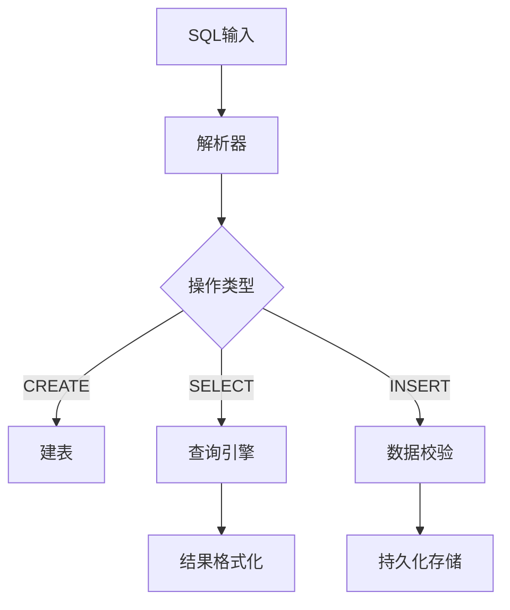

# RustiqueDB 中期报告

## 项目信息
- **选题**：实验四 - 基于Rust实现简单数据库  
- **小组成员**：
  - 杨玉栋（学号：221220012）  
  - 余睿琰（学号：221220083）  
  - 张嘉盛（学号：221220086）

---

## 项目需求
实现一个支持以下功能的关系型数据库：
- 基础数据类型（INT/VARCHAR）
- CRUD操作（CREATE/INSERT/SELECT/UPDATE/DELETE）
- WHERE条件过滤与排序
- 持久化存储
- 符合特定格式的输出

---

## 当前进展

### 已实现功能
1. **核心数据结构**
   - Database/Table/Column层级结构
   - 数据类型支持（INT/VARCHAR）
   - 主键与非空约束

2. **数据库操作**
   ```rust
   CREATE TABLE users (
       id INT(32) PRIMARY KEY,
       name VARCHAR(100) NOT NULL,
       age INT(32)
   );
   ```
   - 持久化存储（JSON序列化）
   - 数据插入与完整性检查

3. **查询功能**
   ```sql
   SELECT name, age FROM users WHERE age > 25 ORDER BY name DESC;
   ```
   - 条件过滤（>, <, =, IS NULL）
   - 多列排序

4. **格式化输出**
   ```
   +-------+-----+
   | name  | age |
   +-------+-----+
   | Alice | 30  |
   +-------+-----+
   ```

---

### 待实现功能
| 功能             | 优先级 | 状态  |
|----------------|--------|-------|
| UPDATE/DELETE操作 | 高     | 未开始|
| SELECT计算表达式    | 高     | 未开始|
| 多行SQL与注释支持     | 中     | 未开始|
| 特色功能           | 高     | 计划中|

---

## 技术细节

### 整体设计


### 特色功能
- **多级排序优化**：支持按多列优先级排序
- **严格类型检查**：插入时验证INT/VARCHAR类型
- **友好的错误提示**：
  ```
  Error: Duplicate entry '1' for key 'PRIMARY'
  Field 'id' doesn't have a default value
  ```

---

## 遇到的问题
1. **生命周期管理**  
   - 在实现排序闭包时遇到`Fn` trait的生命周期冲突  
   - **解决方案**：重构为直接比较而非闭包捕获

2. **空值处理**  
   - NULL与空字符串的语义区分  
   - **当前方案**：统一用空字符串表示NULL

---

## 后续计划
1. 本周完成UPDATE/DELETE操作
2. 下周实现SELECT表达式计算
3. 最终周添加特色功能
